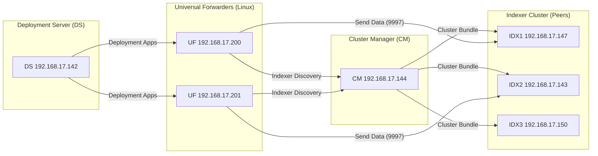

# Splunk Distributed Lab Automation  


This repository contains a full automation framework for deploying and configuring a complete Splunk distributed environment. The project is built around a Bash‑based orchestration script that installs Splunk Enterprise, configures indexer clustering, provisions forwarders, manages deployment server classes, and applies firewall rules across multiple hosts. The script is intentionally written to be transparent, modular, and easy to extend, making it suitable for both lab learning and real‑world operational practice.

---

## Architecture

The lab simulates a production‑grade Splunk deployment with the following components:

- **Cluster Manager (CM)** — Controls indexer clustering, replication, and search factors.
- **Deployment Server (DS)** — Manages forwarder configurations and app distribution.
- **Indexer Cluster (IDX)** — Three indexers configured as cluster peers.
- **Universal Forwarders (UF)** — Linux forwarders configured for indexer discovery and DS enrollment.
- **Firewall Rules** — Automated port configuration for Splunkd and data ingestion.

All Splunk components run version **10.0.2**.

---

## Script Capabilities

The automation script provides a menu‑driven interface that performs installation, configuration, and validation tasks across the entire environment. Each action is executed remotely over SSH using a consistent wrapper for reliability.

### Installation Features

- Installs Splunk Enterprise on CM and indexers.
- Installs Splunk Universal Forwarder on Linux forwarders.
- Automatically downloads Splunk packages.
- Accepts license, sets permissions, and enables boot‑start.

### Configuration Features

- **Cluster Manager Setup**
  - Enables manager mode.
  - Configures replication/search factors.
  - Sets cluster label and symmetric key.
  - Enables indexer discovery.

- **Indexer Configuration**
  - Joins indexers as cluster peers.
  - Enables port 9997 for data ingestion.
  - Restarts Splunk services.

- **Cluster Bundle Management**
  - Creates and pushes index definitions.
  - Validates and applies cluster bundles.

- **Forwarder Configuration**
  - Configures indexer discovery.
  - Sets tcpout groups.
  - Registers forwarders with the Deployment Server.
  - Restarts UF services.

- **Deployment Server Setup**
  - Creates server classes for Linux and Windows.
  - Prepares DS for app distribution.

- **Firewall Automation**
  - Opens required Splunk ports on indexers.

---

## Menu‑Driven Workflow

The script provides an interactive menu for ease of use:

1. Install Splunk on Cluster Manager  
2. Install Splunk on Indexers  
3. Install Linux Forwarders  
4. Configure Cluster Manager  
5. Configure CM Indexes + Push Bundle  
6. Configure Indexers as Peers  
7. Configure Linux Forwarders  
8. Configure Deployment Server  
9. Configure Firewall on Indexers  
10. Show Manual Steps  
0. Exit  

This structure allows the user to run tasks independently or sequentially, depending on the deployment stage.

---

## Remote Execution Model

All operations are executed remotely using:

```bash
ssh -o StrictHostKeyChecking=no splunk@<target>
```
## Example Script Structure

The automation script is built around a consistent pattern:  
1) define environment variables,  
2) wrap SSH execution,  
3) implement remote install/config functions,  
4) expose everything through a menu‑driven interface.

Below is a representative excerpt from the full script:

```bash
#!/bin/bash
set -e
set -x

# ====================== USER VARIABLES ===============================
SPLUNK_VERSION="10.0.2-e2d18b4767e9"
SPLUNK_URL="https://download.splunk.com/products/splunk/releases/10.0.2/linux/splunk-10.0.2-e2d18b4767e9-linux-x86_64.tgz"

CM_IP="192.168.17.144"
DS_IP="192.168.17.142"
MANAGER_URI="https://${CM_IP}:8089"

SPLUNK_HOME="/opt/splunk"

# ====================== SSH WRAPPER =================================
run_ssh() {
    local TARGET="$1"
    shift
    ssh -o StrictHostKeyChecking=no "splunk@${TARGET}" "$@"
}

# ====================== INSTALL SPLUNK ===============================
install_splunk_remote() {
    local TARGET="$1"
    echo "[*] Installing Splunk Enterprise on ${TARGET}"

    ssh splunk@"${TARGET}" <<EOF
wget -O splunk.tgz "${SPLUNK_URL}"
sudo tar -xvzf splunk.tgz -C /opt
sudo chown -R splunk:splunk ${SPLUNK_HOME}
sudo -u splunk ${SPLUNK_HOME}/bin/splunk start --accept-license --answer-yes --no-prompt
sudo ${SPLUNK_HOME}/bin/splunk enable boot-start -user splunk -systemd-managed 1
EOF
}

# ====================== CONFIGURE CLUSTER MANAGER ====================
configure_cm_remote() {
    echo "[*] Configuring Cluster Manager at ${CM_IP}"

    ssh splunk@"${CM_IP}" <<EOF
cat > ${SPLUNK_HOME}/etc/system/local/server.conf <<EOL
[clustering]
mode = manager
cluster_label = cluster1
replication_factor = 3
search_factor = 2
pass4SymmKey = secretkey1
EOL

sudo -u splunk ${SPLUNK_HOME}/bin/splunk restart
EOF
}

# ====================== MENU ========================================
show_menu() {
    echo "================ SPLUNK LAB AUTOMATION ================"
    echo "1) Install Splunk on CM"
    echo "2) Configure Cluster Manager"
    echo "0) Exit"
    echo "======================================================="
}

while true; do
    show_menu
    read -rp "Choose an option: " choice
    case "$choice" in
        1) install_splunk_remote "${CM_IP}" ;;
        2) configure_cm_remote ;;
        0) exit 0 ;;
        *) echo "Invalid option" ;;
    esac
done
```


